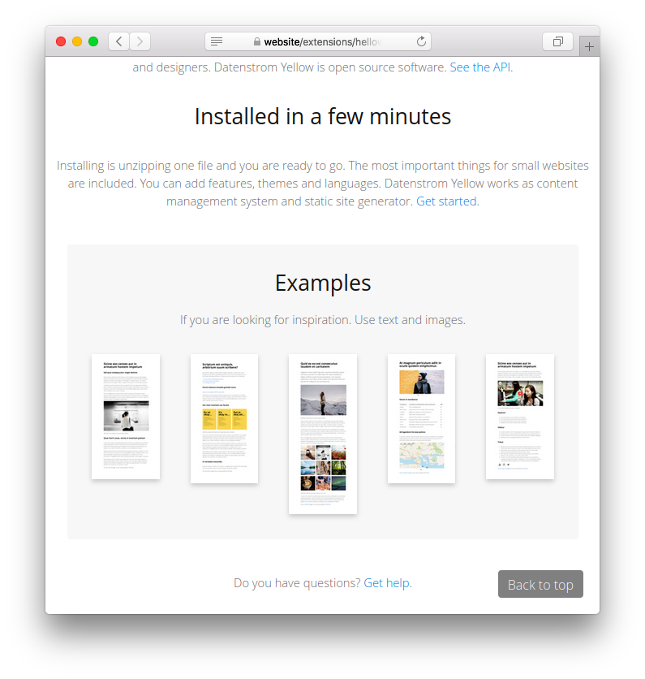

# Backtotop 0.8.22

Back-to-top link.

## How to install an extension

[Download ZIP file](https://github.com/GiovanniSalmeri/yellow-backtotop/archive/refs/heads/main.zip) and copy it into your `system/extensions` folder. [Learn more about extensions](https://github.com/annaesvensson/yellow-update).

## How to add a Back-to-top link

This extension puts a back-to-top link on all pages of the site. The link is shown when the page is scrolled down.

If you want to customise the link with CSS, edit the files in your `system/themes` folder.

## Developer

Giovanni Salmeri. [Get help](https://datenstrom.se/yellow/help/).
